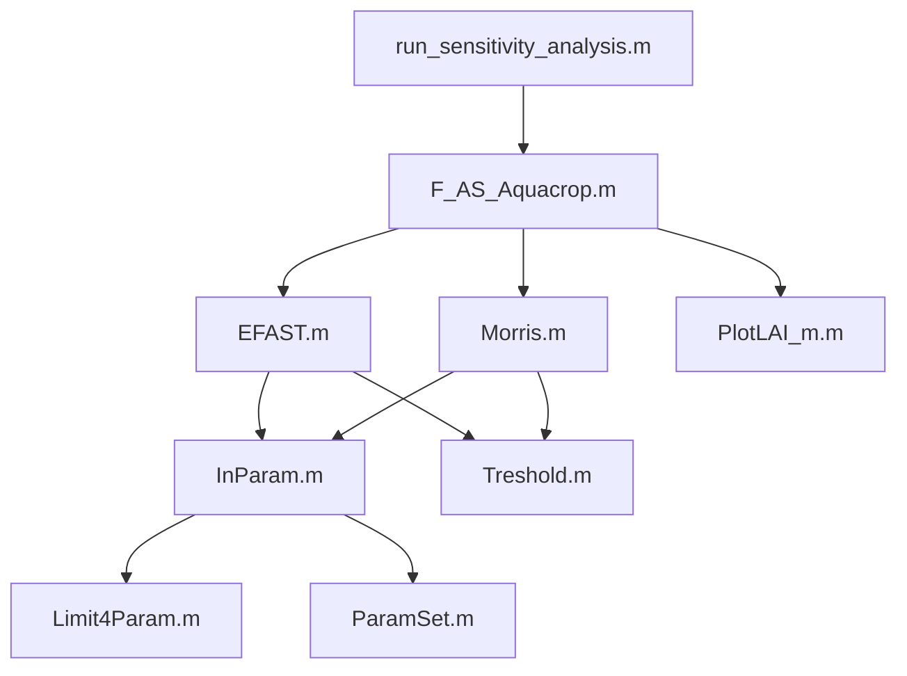

# AquaCrop 敏感性分析项目

## 1. 项目概述
- 项目简介
- 主要功能
- 技术特点
- 应用场景

## 2. 快速开始
- 环境要求
- 安装步骤
- 基本使用
- 运行示例

## 3. 项目结构
### 3.1 目录结构
```
项目根目录/
├── F_AS_Aquacrop.m          # 主控制函数
├── EFAST.m                  # EFAST方法实现
├── Morris.m                 # Morris方法实现
├── run_sensitivity_analysis.m # 自动化运行脚本
└── README.md                # 项目说明文档
```

### 3.2 核心组件
- 主控制模块
- 分析方法模块
- 工具函数模块
- 可视化模块

## 4. 敏感性分析方法
### 4.1 EFAST方法
- 原理说明
- 参数设置
- 结果解读

### 4.2 Morris方法
- 原理说明
- 参数设置
- 结果解读

## 5. 参数说明
### 5.1 关键参数列表
- 作物生长参数
- 土壤水分参数
- 根系参数
- 胁迫参数

### 5.2 参数校准指南
- 校准原则
- 校准步骤
- 注意事项

## 6. 文件说明
### 6.1 核心文件
| 文件名 | 主要功能 | 输入 | 输出 | 调用关系 |
|--------|----------|------|------|----------|
| F_AS_Aquacrop.m | 主控制函数 | fileinput, Param | 敏感性指标, 模拟结果 | 调用EFAST.m或Morris.m |
| EFAST.m | EFAST方法实现 | fileinput, 参数定义, 参数范围 | 主效应指数, 总效应指数 | 被F_AS_Aquacrop.m调用 |
| Morris.m | Morris方法实现 | fileinput, 参数定义, 参数范围 | μ*, σ值, 参数重要性 | 被F_AS_Aquacrop.m调用 |
| run_sensitivity_analysis.m | 自动化运行脚本 | 配置文件路径 | 分析结果文件 | 调用F_AS_Aquacrop.m |

### 6.2 工具函数
| 文件名 | 主要功能 | 输入 | 输出 | 使用场景 |
|--------|----------|------|------|----------|
| InParam.m | 参数初始化 | 参数范围, 默认值 | 初始化参数集 | 分析开始前 |
| Treshold.m | 阈值计算 | 敏感性指标 | 阈值判断结果 | 参数筛选时 |
| PlotLAI_m.m | LAI数据可视化 | 时间序列数据 | 图形输出 | 结果分析时 |
| Limit4Param.m | 参数限制检查 | 参数值, 范围 | 有效性判断 | 参数设置时 |
| ParamSet.m | 参数批量设置 | 参数配置 | 参数矩阵 | 批量处理时 |

### 6.3 配置文件
| 文件名 | 数据类型 | 主要内容 | 使用位置 |
|--------|----------|----------|----------|
| AC_fileinput_ref.mat | 模型配置 | 气候/土壤/作物数据 | 模型运行前加载 |
| AC_Param_ref.mat | 参数配置 | 参数范围/分布设置 | 敏感性分析时使用 |

### 6.4 结果文件
| 文件名 | 数据类型 | 主要内容 | 生成时机 |
|--------|----------|----------|----------|
| AC_Xiao_XX_results.mat | 模拟结果 | 时间序列/产量数据 | 模拟完成后 |
| AC_Xiao_XX_results_EFAST.mat | 分析结果 | 敏感性指标/排序 | EFAST分析后 |

## 7. 开发指南
### 7.1 代码规范
- 命名规则
- 注释要求
- 错误处理

### 7.2 版本控制
- Git使用规范
- 发布流程
- 文档更新

### 7.3 文件依赖关系


## 8. 常见问题
- 运行问题
- 参数设置
- 结果分析
- 错误处理

## 9. 维护说明
### 9.1 文件修改频率
| 文件类型 | 修改频率 | 修改原因 | 注意事项 |
|----------|----------|----------|----------|
| 核心算法文件 | 低 | 算法优化/Bug修复 | 需要全面测试 |
| 工具函数 | 中 | 功能扩展/优化 | 注意兼容性 |
| 配置文件 | 高 | 参数调整/场景变化 | 保留备份 |
| 可视化脚本 | 中 | 展示需求变化 | 注意图表规范 |
| 结果文件 | 高 | 新增分析结果 | 注意命名规范 |

## 10. 联系方式
如有问题或建议，请联系项目维护者。
